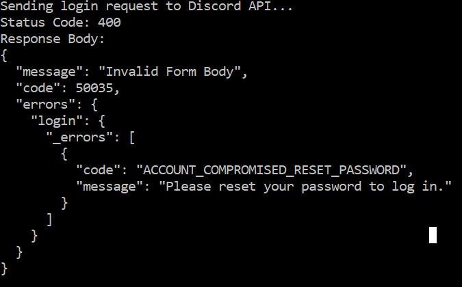
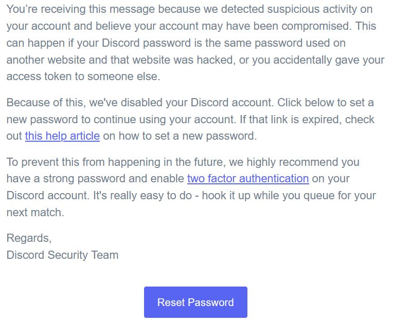

 Having a Look at an App's API Calls

## What's the story?

The plan for this project was to have a look at how a modern app, the Discord desktop client, talks to its servers. The idea was to intercept the login process, figure out how the API call was put together, and then write a simple Python script to do the exact same thing.

Analyze network traffic and understand how authentication works under the hood. It was a good lesson in troubleshooting, as the first tool (Mitmproxy) didn't play ball with my machine's setup, so I had to pivot to Fiddler Classic to get the job done.

## Skills I put to use:
*   **Network Traffic Analysis:** Using a proxy (Fiddler Classic) to capture and decrypt live HTTPS traffic.
*   **API Reverse Engineering:** Picking apart the captured requests to figure out the API's endpoint, headers, and payload.
*   **Python Scripting:** Building a tool from scratch with the `requests` library to talk to the API.
*   **Problem Solving & Adaptability:** Switching from a non-working tool to an alternative to ensure the project got finished.

## The Tools for the Job:
*   **The Target:** Discord Desktop Client
*   **The Proxy:** Fiddler Classic
*   **The Scripting:** Python 3 with the `requests` library

---

## The Grand Finale: The Script in Action

The Python script successfully replicates the client's API call, triggering a real-world security response from Discord's servers. 



---

## How It Was All Done

### Part 1: The Detective Work (Interception with Fiddler)

**1. Capturing the Login:**
After getting Fiddler set up to decrypt HTTPS, I logged out of Discord to force a fresh login. By clearing Fiddler's log and then logging back in, I was able to capture the exact moment of authentication and isolate the specific API call from all the other noise.

**2. Analyzing the Call:**
The key request was a `POST` to `/api/v9/auth/login`. By digging into this request in Fiddler's inspectors, I found all the clues needed to build my own script: the exact URL, the required HTTP headers (like `User-Agent`), and the JSON structure of the login details being sent.

### Part 2: The "Plot Twist" - A Real-World Security Response

Instead of a simple "success" or "wrong password" message, the script got a very interesting response from Discord's servers.

The `ACCOUNT_COMPROMISED_RESET_PASSWORD` error code is brilliant. It shows that Discord's security systems correctly identified the login attempt from my script as "suspicious" because it was slightly different from a real client. As a precaution, it blocked the login and triggered a security alert, which even resulted in a real email.This was a real-world example of an anti-abuse system in action.



### Part 3: Building the Tool (The Python Script)

With all the clues gathered, I wrote this Python script. It pieces together the URL, headers, and payload to mimic the real Discord client. All the sensitive info has been swapped out for placeholders.

```python
import requests
import json

# The URL for the Discord authentication endpoint
url = "https://discord.com/api/v9/auth/login"

# Headers are copied from Fiddler to mimic the real Discord client
headers = {
    "Content-Type": "application/json",
    "User-Agent": "Placeholder",
    "X-Super-Properties": "Placeholder"
}

# The data payload structure, with credentials replaced by placeholders.
# Real credentials have been replaced with placeholders for security.
payload = {
    "login": "Placeholder",
    "password": "Placeholder",
    "undelete": False
}

# Send the POST request and print the server's response
print("Sending login request to Discord API...")
response = requests.post(url, headers=headers, json=payload)

print(f"Status Code: {response.status_code}")
print("Response Body:")
try:
    print(json.dumps(response.json(), indent=2))
except json.JSONDecodeError:
    print(response.text)


### Disclaimer

This project was conducted for purely educational purposes to understand API authentication and network security. It is not intended to be used for any malicious activity or to violate Discord's Terms of Service.

What I Reckon in the End

This was a great project for diving into how modern apps work. It showed that security isn't just about getting a password right; it's also about a server being smart enough to spot when something looks a bit "off." Pivoting from a failed tool to a working one was also a good lesson in not getting stuck on one solution.